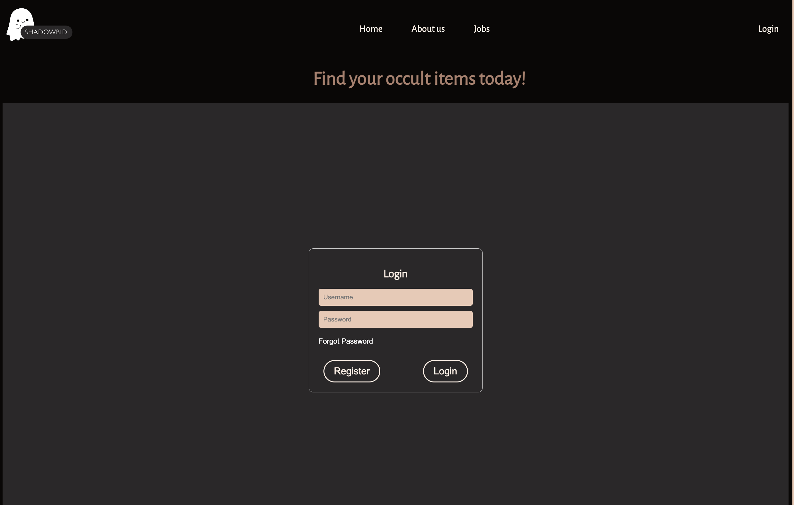
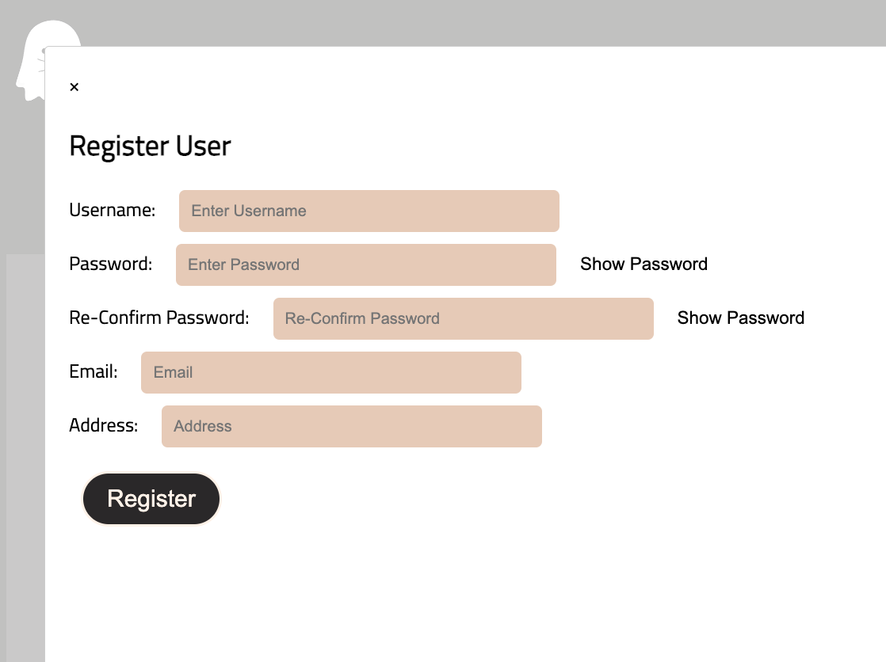
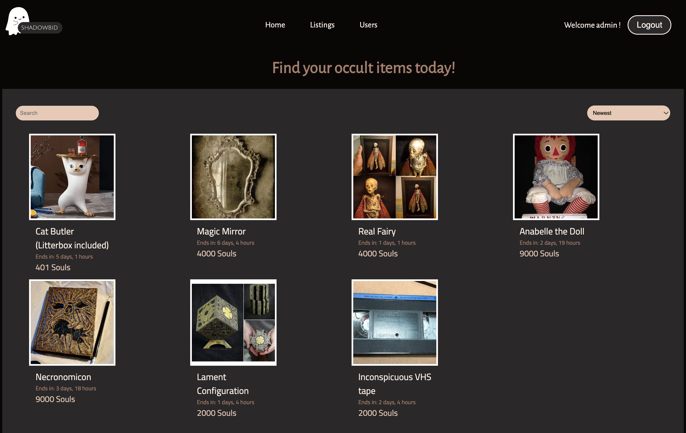
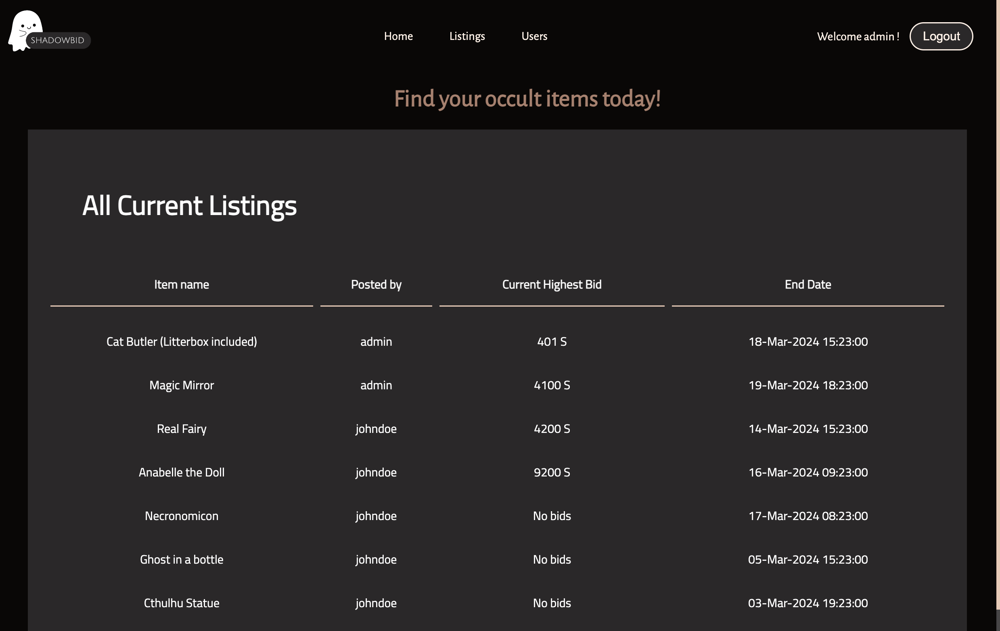
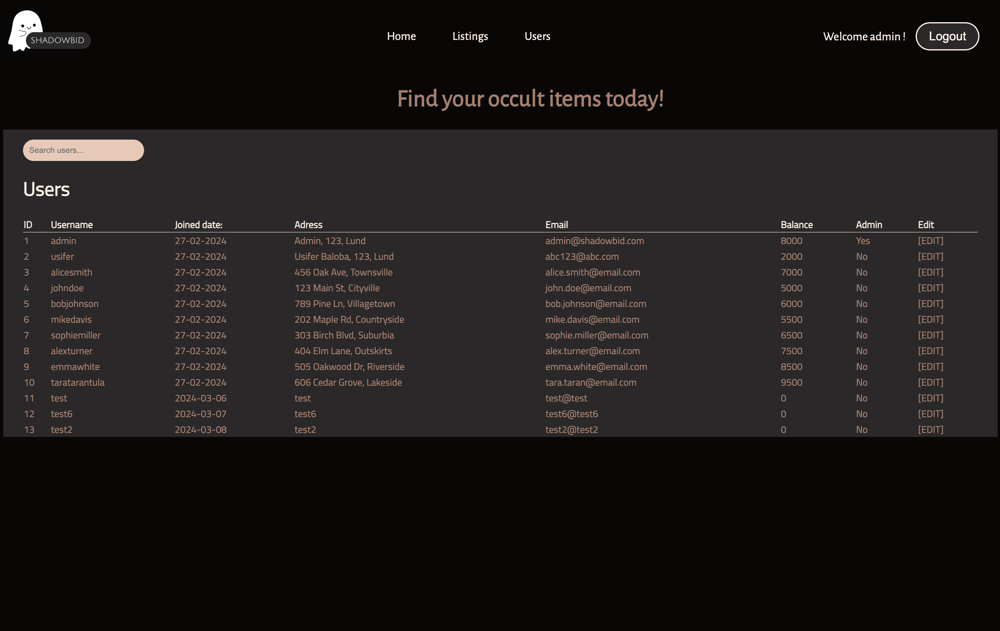
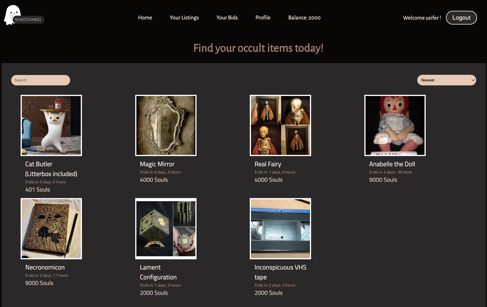
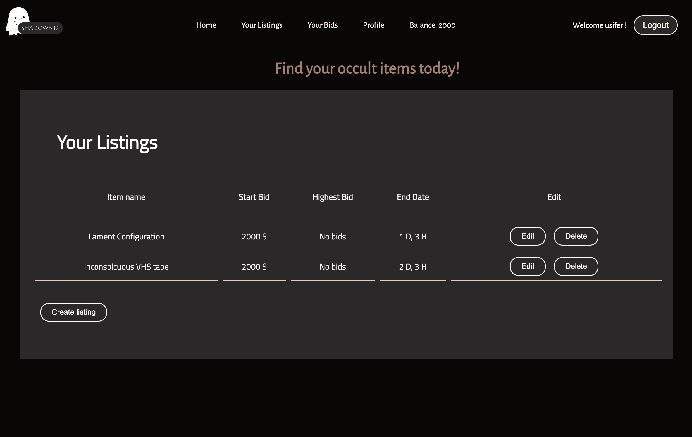
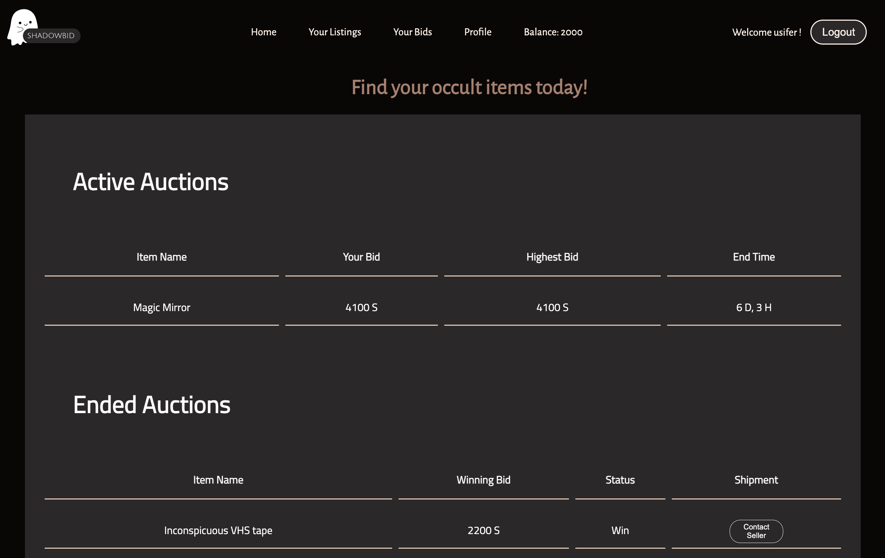
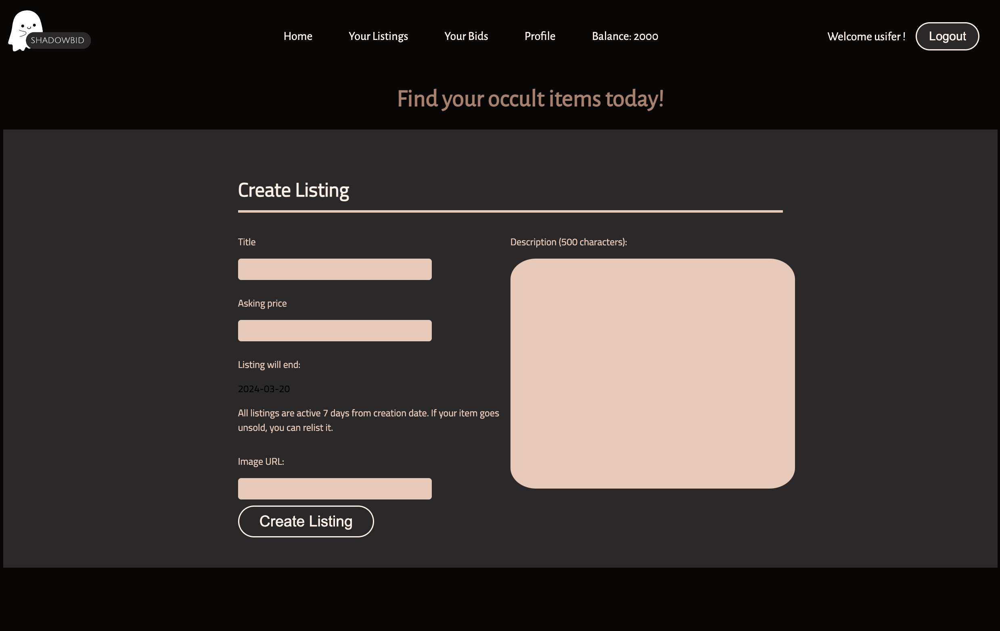
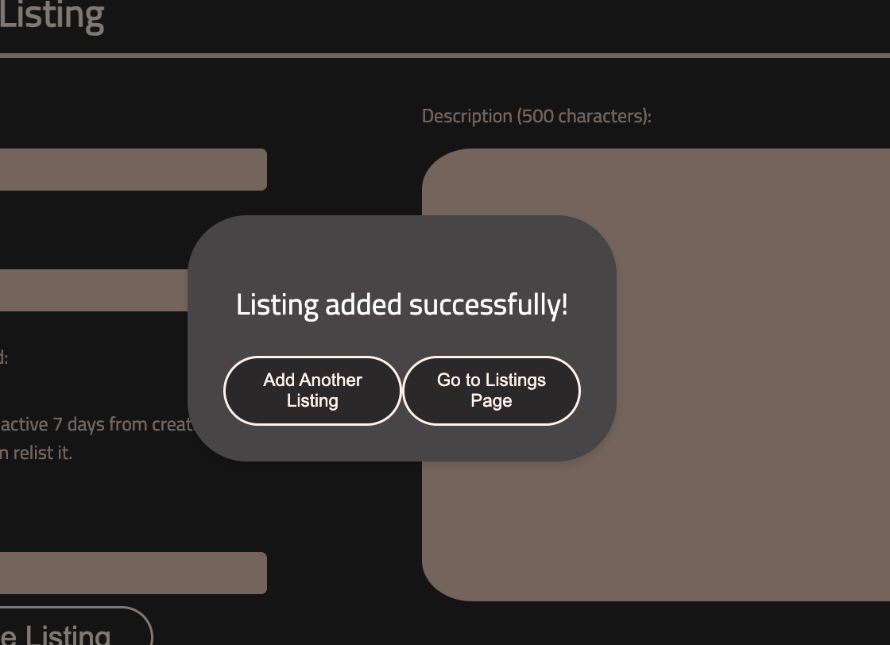

# Shadow Bid 
An auction site for individuals who are interested in purchasing by bidding or selling occult items built with React, Javascript, CSS, and mock database using JSON-Server. 

## Table of Content:
- [Features](#features)
- [Screenshots](#screenshots)
- [Technologies](#technologies)
- [Setup](#setup)
- [Status](#status)
- [Credits](#credits)

## Features

- Browse auction listings
- Search listings by keyword
- Filter listings
- View more information about the items
- Make a bid
- Read more about the site
- Read more about job oportunities
- User authentication 
- Manage auction listings as an admin and user (create, read, update, delete)
- Manage user information as an admin (read, update, delete)
- As a user view bids made as well as won/lost auctions.
- Edit profile
- User can update their balance

## Screenshots

## Technologies
We used the following teachnologies React, Vite, Node.js, JSON-Server

## Setup
- download or clone the repository
- run `npm install`
- run `npm run dev`
- run `npm install json-server` 
- navigate to the public directory; run `cd public`
- run `npx json-server db.json` to run mock database server

## Status
This project is currently in development.

## Credits
List of contriubutors:
- [Konrad Natthagel](https://github.com/nighthail)
- [Sara Jakobsson](https://github.com/sarajac1)
- [Arsenty Streltsov](https://github.com/ArsentyStreltsov)
- [Rajesh Naraharasetty](https://github.com/RJKN13)
- [Laura Vetukuri](https://github.com/ti3ktock)

